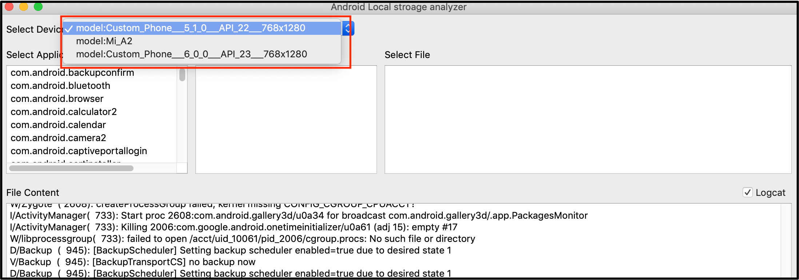
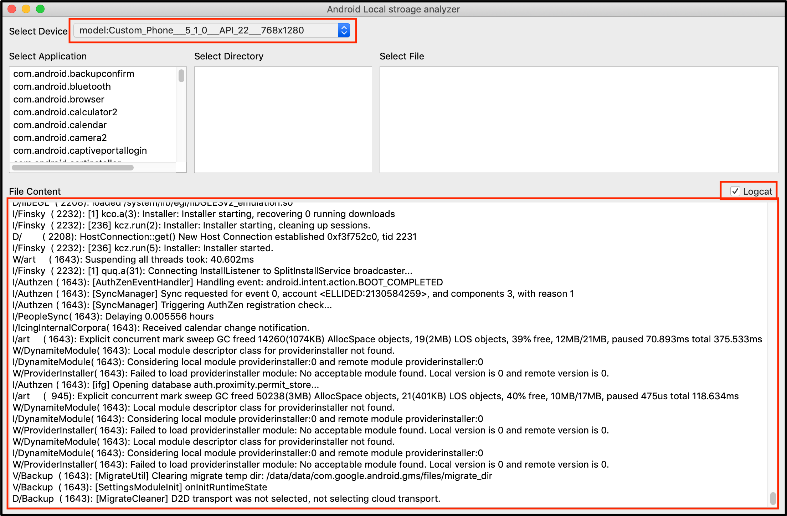
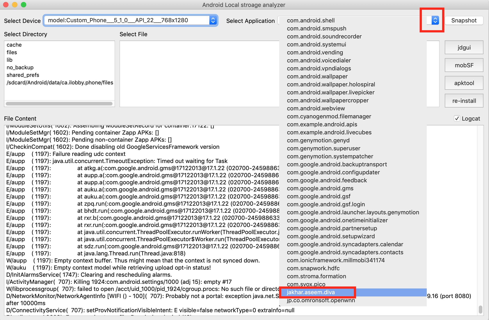
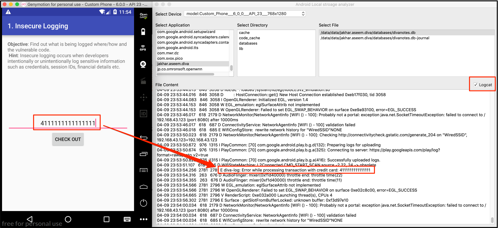

# Android Application Analyzer

The tool is used to analyze the content of the android application in local storage.

It will list down all the devices connected to the device as shown in Figure:

It will start fetching logcat logs for the selected device as shown in Figure:

To analyze the file content of the application, Select the file as shown in Figure:

Analyze the sensitive information logcat logs as shown in Figure:

# Future Enhancement

- Deep search
    - Find all the files of the application from the entire storage
- Right click save option for file
    - Save the file content for future reference
- Snapshot button
    - Copy entire application directory for future reference
- The dropdown list of the application instead of Text Box 
- Strings command on “so or library” file
- Compatible with python3

# References

- https://stackoverflow.com/questions/11524586/accessing-logcat-from-android-via-python
- https://payatu.com/wp-content/uploads/2016/01/diva-beta.tar.gz
- https://pythonspot.com/pyqt5/

